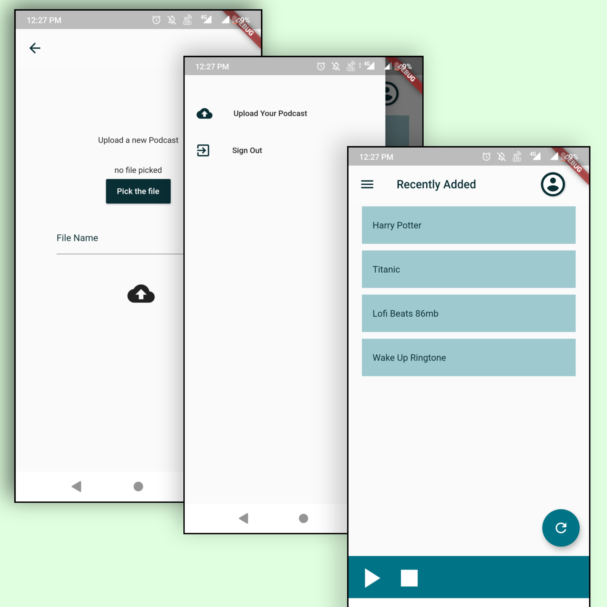

# Music Player using Flutter

## Authentication Page
- Firebase is used for Authentication.
- CustomPainter is used for UI Designing.

 

## Home Page
- File Picker is used for Selecting files from Local Storage.
- Firebase Storage is used for uploading files to Cloud.
- FireStore is used to store the File details.
- just_audio is used for Streaming the audio online.

